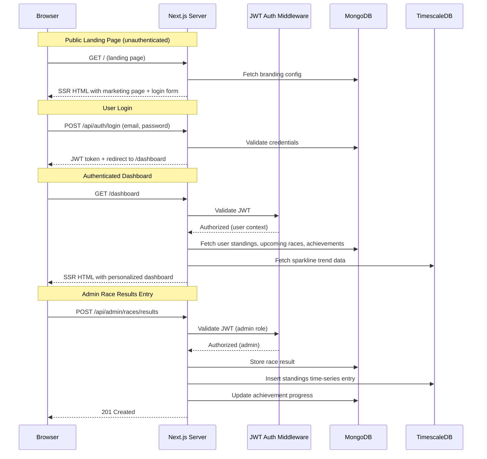
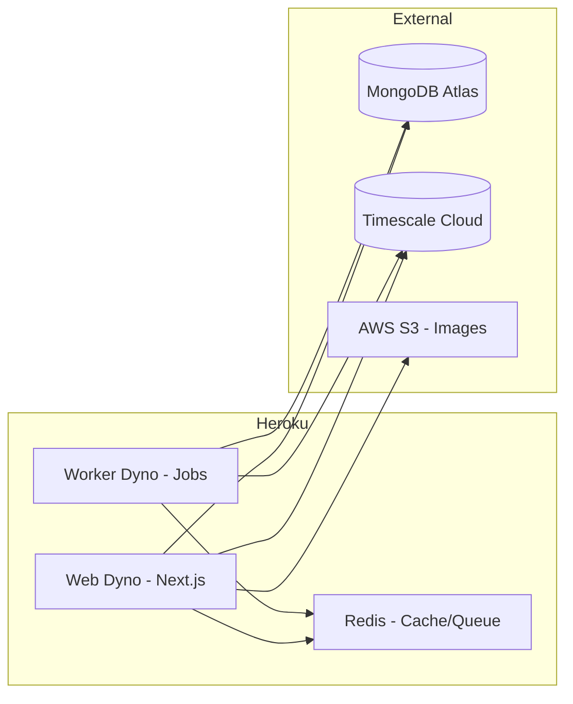

# Design Document: Bike Racing League

## Overview

The Bike Racing League is a full-stack web application for managing amateur bike racing leagues. It provides administrators with tools to manage people, organizations, races, results, standings, achievements, and awards—all organized by season. The application has two distinct experiences: a public marketing/login landing page for unauthenticated visitors, and a personalized dashboard for authenticated users (racers, volunteers, mentors, officials, and administrators).

The system uses Next.js as a full-stack framework, combining server-side rendering for public pages with API routes for data operations. MongoDB serves as the primary data store for entity management, while TimescaleDB handles time-series analytics (standings history, race result trends, computed recognitions). The application is hosted on Heroku and uses JWT-based authentication for all users.

### Key Design Decisions

1. **Next.js API Routes as Backend**: Rather than a separate backend service, we use Next.js API routes (`/api/*`) to serve both the SSR frontend and the RESTful API. This simplifies deployment while still exposing a clean API for future mobile clients.

2. **Dual Database Strategy**: MongoDB for flexible document storage (people, organizations, races, configurations) and TimescaleDB for time-series data (standings snapshots, performance trends, computed recognitions). This plays to each database's strengths.

3. **Branding as Runtime Configuration**: League branding (colors, logos, name) is stored in MongoDB and applied at render time via CSS custom properties, enabling instant updates without redeployment.

4. **Competition-Based Standings Architecture**: Standings are computed per-Competition with configurable eligibility criteria, supporting parallel competitions (Overall, Rookie, Time Trial Cup, etc.) from a single set of race results.

---

## Architecture

### System Architecture Diagram

```mermaid
graph TB
    subgraph Client["Client (Browser)"]
        UI[React UI - Next.js Pages]
        TQ[TanStack Query]
        ZS[Zustand Store]
    end

    subgraph Heroku["Heroku Platform"]
        subgraph NextApp["Next.js Application"]
            SSR[SSR / Static Pages]
            API[API Routes /api/*]
            MW[Middleware - Auth, Logging]
        end
        
        subgraph Data["Data Layer"]
            MDB[(MongoDB)]
            TSDB[(TimescaleDB)]
        end
        
        subgraph Storage["File Storage"]
            S3[AWS S3 / Cloudinary - Logos & Badges]
        end
    end

    UI --> TQ
    TQ --> API
    ZS --> UI
    SSR --> MDB
    API --> MW
    MW --> MDB
    MW --> TSDB
    API --> S3
    
    style Client fill:#1a1a2e,stroke:#b87333
    style Heroku fill:#16213e,stroke:#b87333
```



### Request Flow



### Deployment Architecture (Heroku)

- **Web Dyno**: Next.js application (SSR + API routes)
- **Worker Dyno**: Background jobs (standings recalculation, computed recognitions)
- **MongoDB**: MongoDB Atlas (Heroku add-on or external)
- **TimescaleDB**: Timescale Cloud (Heroku add-on or external)
- **File Storage**: AWS S3 or Cloudinary for logo/badge images
- **Redis**: Heroku Redis for job queues and caching branding config



---

## Components and Interfaces

### Frontend Components

#### Layout Components

| Component | Description |
|-----------|-------------|
| `PublicLayout` | Layout for unauthenticated pages with top navigation bar (logo, Features, Leagues, About, Contact, Request a Demo) |
| `AuthenticatedLayout` | Layout for authenticated pages with sidebar navigation, top bar, and content area |
| `Sidebar` | Left navigation panel for authenticated users (Dashboard, Calendar, Races, Standings, Teams, Academy, Achievements, Mentors, Messages, Profile) |
| `TopBar` | Authenticated top bar with league name selector dropdown, notification bell, user avatar |
| `PublicNavBar` | Top navigation for public pages (logo, Features, Leagues, About, Contact, Request a Demo button) |
| `ThemeProvider` | Applies branding colors via CSS custom properties from Branding_Configuration |

#### Page Components

| Page | Route | Auth Required | Layout |
|------|-------|---------------|--------|
| `LandingPage` | `/` | No | Public |
| `StandingsPage` | `/standings` | No | Public |
| `AboutPage` | `/about` | No | Public |
| `AcademyPage` | `/academy` | No | Public |
| `FeaturesPage` | `/features` | No | Public |
| `ContactPage` | `/contact` | No | Public |
| `TrophyCasePage` | `/trophy-case/[personId]` | No | Public |
| `TeamTrophyCasePage` | `/trophy-case/team/[orgId]` | No | Public |
| `UserDashboard` | `/dashboard` | Yes | Authenticated (renders RacerDashboard, AdminDashboard, or GeneralDashboard based on role priority) |
| `RacerDashboard` | `/dashboard` | Yes (Racer) | Authenticated - shown if user has Racer role |
| `AdminDashboard` | `/dashboard` | Yes (Admin, not Racer) | Authenticated - shown if user has Admin role but not Racer |
| `GeneralDashboard` | `/dashboard` | Yes (other) | Authenticated - shown if user is neither Racer nor Admin |
| `UserCalendar` | `/dashboard/calendar` | Yes | Authenticated |
| `UserRaces` | `/dashboard/races` | Yes | Authenticated |
| `UserStandings` | `/dashboard/standings` | Yes | Authenticated |
| `UserTeams` | `/dashboard/teams` | Yes | Authenticated |
| `UserAchievements` | `/dashboard/achievements` | Yes | Authenticated |
| `UserMentors` | `/dashboard/mentors` | Yes | Authenticated |
| `UserMessages` | `/dashboard/messages` | Yes | Authenticated |
| `UserProfile` | `/dashboard/profile` | Yes | Authenticated |
| `AdminDashboard` | `/admin` | Yes (Admin) | Authenticated |
| `AdminPeoplePage` | `/admin/people` | Yes (Admin) | Authenticated |
| `AdminRacesPage` | `/admin/races` | Yes (Admin) | Authenticated |
| `AdminResultsPage` | `/admin/races/[raceId]/results` | Yes (Admin) | Authenticated |
| `AdminOrganizationsPage` | `/admin/organizations` | Yes (Admin) | Authenticated |
| `AdminSeasonsPage` | `/admin/seasons` | Yes (Admin) | Authenticated |
| `AdminBrandingPage` | `/admin/branding` | Yes (Admin) | Authenticated |
| `AdminCompetitionsPage` | `/admin/competitions` | Yes (Admin) | Authenticated |
| `AdminAchievementsPage` | `/admin/achievements` | Yes (Admin) | Authenticated |
| `AdminAwardsPage` | `/admin/awards` | Yes (Admin) | Authenticated |

#### User Dashboard Widgets (authenticated view - role-based variants)

**Racer Dashboard** (user holds Racer role — highest priority):

| Widget | Description |
|--------|-------------|
| `LeagueStandingWidget` | Shows user's current standing position, points, races, best finish with sparkline trend |
| `NextRaceWidget` | Countdown timer to next race with name, date, location |
| `RecentResultsWidget` | Latest race results summary with position and race type icons |
| `AchievementsWidget` | Earned badges with progress indicators and next-to-unlock |
| `UpcomingEventsCarousel` | Horizontal scroll of upcoming race cards with date badges |
| `UserProfileCard` | Sidebar bottom card with name, category, team, "View Profile" link |
| `TrainingProgressWidget` | Weekly training hours, fitness metrics (future phase) |
| `AcademyProgressWidget` | Academy level progress indicator (future phase) |

**Admin Dashboard** (user holds Administrator role but NOT Racer):

| Widget | Description |
|--------|-------------|
| `QuickActionsWidget` | Buttons for common tasks: add results, manage people, manage races |
| `RecentActivityWidget` | Feed of latest league activity (results entered, registrations, nominations) |
| `SeasonStatusWidget` | Current season info and upcoming race schedule |
| `ActionItemsWidget` | Pending peer nominations, incomplete results, system alerts |

**General Dashboard** (user holds neither Racer nor Administrator role):

| Widget | Description |
|--------|-------------|
| `UpcomingEventsWidget` | Upcoming races with dates, names, locations |
| `StandingsHighlightsWidget` | Top standings and recent league news |
| `RoleInfoWidget` | Role-specific content (volunteer assignments, mentorship, officiating schedule) |
| `AwardsWidget` | User's earned awards and league notifications |

**Dashboard role priority**: Racer > Administrator > General. A user who is both a Racer and Admin sees the Racer Dashboard (with admin functions accessible via sidebar).

**Extensibility**: The dashboard variant selection uses a registry pattern — an ordered array of `{ role, component, priority }` entries. To add a new role-based dashboard (e.g., a Mentor Dashboard or Volunteer Dashboard), register a new entry with the appropriate priority. The system evaluates the user's roles against the registry in priority order and renders the first match. The General Dashboard serves as the fallback when no role-specific entry matches.

```typescript
// Dashboard variant registry (priority order, highest first)
interface DashboardVariant {
  role: Role | null;     // null = fallback (General Dashboard)
  component: React.ComponentType;
  priority: number;      // higher number = higher priority
}

const dashboardRegistry: DashboardVariant[] = [
  { role: 'racer', component: RacerDashboard, priority: 100 },
  { role: 'administrator', component: AdminDashboard, priority: 50 },
  // Future: { role: 'mentor', component: MentorDashboard, priority: 75 },
  // Future: { role: 'volunteer', component: VolunteerDashboard, priority: 60 },
  { role: null, component: GeneralDashboard, priority: 0 }, // fallback
];

function resolveDashboard(userRoles: Role[]): React.ComponentType {
  const sorted = [...dashboardRegistry].sort((a, b) => b.priority - a.priority);
  const match = sorted.find(v => v.role === null || userRoles.includes(v.role));
  return match?.component ?? GeneralDashboard;
}
```

#### Landing Page Sections (public view)

| Section | Description |
|---------|-------------|
| `HeroSection` | Full-width cycling photo with tagline, description, and CTA buttons |
| `LoginCard` | Right-aligned card with email/password form, social login buttons, create account link |
| `FeatureHighlights` | Vertical list of platform features (Compete, Develop, Connect, Organize) with icons |
| `ValuePropositions` | Footer-area row of 4 value props with icons (Built for Racers, Stronger Together, etc.) |
| `PublicFooter` | Copyright, legal links, social media icons |

### Backend API Routes

#### Public Endpoints (No Auth)

| Method | Route | Description |
|--------|-------|-------------|
| GET | `/api/standings` | Current standings for active season |
| GET | `/api/standings/[seasonId]` | Historical standings for a specific season |
| GET | `/api/standings/team` | Team standings for active season |
| GET | `/api/races/upcoming` | Upcoming races |
| GET | `/api/races/[raceId]/results` | Results for a specific race |
| GET | `/api/people/[personId]/trophy-case` | Person's trophy case |
| GET | `/api/organizations/[orgId]/trophy-case` | Team's trophy case |
| GET | `/api/branding` | Current branding configuration |
| GET | `/api/seasons` | All seasons (for historical views) |
| GET | `/api/competitions` | Active competitions |
| POST | `/api/auth/login` | Email/password login |
| POST | `/api/auth/refresh` | Refresh JWT token |
| POST | `/api/auth/register` | New user registration |
| POST | `/api/auth/google` | Google OAuth login |
| POST | `/api/auth/apple` | Apple OAuth login |
| POST | `/api/auth/forgot-password` | Initiate password reset |
| POST | `/api/auth/reset-password` | Complete password reset |

#### Protected Endpoints (Admin Auth Required)

| Method | Route | Description |
|--------|-------|-------------|
| POST/PUT/DELETE | `/api/admin/people` | CRUD people |
| POST/PUT/DELETE | `/api/admin/organizations` | CRUD organizations |
| POST/PUT/DELETE | `/api/admin/races` | CRUD races |
| POST/PUT | `/api/admin/races/[raceId]/results` | Enter/update race results |
| POST/PUT/DELETE | `/api/admin/seasons` | CRUD seasons |
| POST/PUT/DELETE | `/api/admin/competitions` | CRUD competitions |
| POST/PUT/DELETE | `/api/admin/achievements` | CRUD achievements |
| POST/PUT/DELETE | `/api/admin/awards` | CRUD awards |
| POST/PUT | `/api/admin/awards/assign` | Assign awards to people |
| POST/PUT/DELETE | `/api/admin/calculated-recognitions` | CRUD calculated recognitions |
| PUT | `/api/admin/branding` | Update branding configuration |
| GET/PUT | `/api/admin/nominations` | View/approve peer nominations |

#### Peer Nomination Endpoints (Authenticated Users)

| Method | Route | Description |
|--------|-------|-------------|
| POST | `/api/nominations` | Submit a peer nomination |

### Service Layer

```mermaid
classDiagram
    class PersonService {
        +create(data): Person
        +update(id, data): Person
        +assignRoles(id, roles): Person
        +removeRole(id, role): Person
        +getById(id): Person
        +list(filters): Person[]
    }

    class OrganizationService {
        +create(data): Organization
        +update(id, data): Organization
        +addMember(orgId, personId): void
        +removeMember(orgId, personId): void
        +getTeams(): Organization[]
    }

    class RaceService {
        +create(data): Race
        +update(id, data): Race
        +assignOfficials(raceId, personIds): void
        +assignVolunteers(raceId, personIds): void
        +getUpcoming(): Race[]
    }

    class RaceResultService {
        +enter(raceId, results): RaceResult[]
        +validate(result): ValidationResult
        +getByRace(raceId): RaceResult[]
        +getByRacer(personId, seasonId): RaceResult[]
    }

    class StandingsService {
        +calculate(competitionId, seasonId): Standing[]
        +calculateTeam(competitionId, seasonId): TeamStanding[]
        +recalculateAll(seasonId): void
        +getHistory(competitionId, seasonId): TimeSeriesData
    }

    class AchievementService {
        +define(data): Achievement
        +checkAndAward(personId, seasonId): void
        +getByPerson(personId): Achievement[]
        +resetForSeason(seasonId): void
    }

    class AwardService {
        +define(data): Award
        +assign(awardId, personId, seasonId): void
        +submitNomination(data): PeerNomination
        +approveNomination(nominationId): void
    }

    class SeasonService {
        +create(data): Season
        +getActive(): Season
        +validateNoOverlap(start, end): boolean
        +markInactive(seasonId): void
    }

    class CompetitionService {
        +create(data): Competition
        +evaluateEligibility(raceResult, competition): boolean
        +getActive(): Competition[]
    }

    class BrandingService {
        +get(): BrandingConfiguration
        +update(data): BrandingConfiguration
        +uploadLogo(variant, file): string
        +validateColors(colors): boolean
    }

    class CalculatedRecognitionService {
        +define(data): CalculatedRecognition
        +compute(seasonId): Recognition[]
        +getMostImproved(seasonId, period): Person
        +getBiggestMover(seasonId, period): Person
    }
```



### Middleware Stack

1. **Morgan** - HTTP request logging
2. **Helmet** - Security headers
3. **JWT Verification** - Token validation for protected routes
4. **Rate Limiting** - API rate limiting (per-IP for public, per-user for admin)
5. **Branding Loader** - Injects current branding config into SSR context

---

## Data Models

### MongoDB Collections

#### `people`
```typescript
interface Person {
  _id: ObjectId;
  name: {
    first: string;
    last: string;
  };
  email: string;
  phone?: string;
  roles: Role[]; // ['racer', 'volunteer', 'mentor', 'race_official', 'administrator']
  category?: Category; // 'cat1' | 'cat2' | 'cat3' | 'cat4' | 'cat5' | 'beginner'
  categoryHistory: CategoryChange[];
  usaCyclingLicense?: string;
  organizationIds: ObjectId[];
  passwordHash?: string; // For email/password auth
  authProvider?: 'local' | 'google' | 'apple';
  authProviderId?: string; // External provider user ID
  isRegistered: boolean; // true if user has created an account (vs admin-added person without login)
  createdAt: Date;
  updatedAt: Date;
}

interface CategoryChange {
  from: Category | null;
  to: Category;
  changedAt: Date;
  changedBy: ObjectId; // admin who made the change
}
```

#### `organizations`
```typescript
interface Organization {
  _id: ObjectId;
  name: string; // unique
  type: 'team' | 'promoter' | 'sponsor' | 'other';
  description?: string;
  memberIds: ObjectId[];
  createdAt: Date;
  updatedAt: Date;
}
```

#### `seasons`
```typescript
interface Season {
  _id: ObjectId;
  name: string;
  startDate: Date;
  endDate: Date;
  isActive: boolean;
  createdAt: Date;
  updatedAt: Date;
}
```

#### `races`
```typescript
interface Race {
  _id: ObjectId;
  name: string;
  date: Date;
  location: {
    name: string;
    address?: string;
    coordinates?: { lat: number; lng: number };
  };
  raceType: RaceType; // 'crit' | 'time_trial' | 'road_race' | 'cyclocross' | 'gravel' | 'track' | string
  categories: Category[];
  seasonId: ObjectId;
  competitionIds: ObjectId[];
  officialIds: ObjectId[];
  volunteerIds: ObjectId[];
  status: 'scheduled' | 'in_progress' | 'completed' | 'cancelled';
  createdAt: Date;
  updatedAt: Date;
}
```

#### `race_results`
```typescript
interface RaceResult {
  _id: ObjectId;
  raceId: ObjectId;
  racerId: ObjectId;
  seasonId: ObjectId;
  category: Category;
  position: number;
  finishTime: number; // milliseconds
  points?: number; // computed based on competition scoring rules
  createdAt: Date;
  updatedAt: Date;
}
// Unique compound index: { raceId, racerId } to prevent duplicates
```

#### `competitions`
```typescript
interface Competition {
  _id: ObjectId;
  name: string; // e.g., "Overall League Champion", "Rookie Championship"
  description?: string;
  seasonId: ObjectId;
  type: 'individual' | 'team';
  scoringMethod: ScoringMethod;
  eligibilityCriteria: EligibilityCriteria;
  isActive: boolean;
  createdAt: Date;
  updatedAt: Date;
}

interface EligibilityCriteria {
  racerCriteria?: {
    categories?: Category[];
    firstYearOnly?: boolean;
    minRaces?: number;
  };
  raceCriteria?: {
    raceTypes?: RaceType[];
    specificRaceIds?: ObjectId[];
  };
}

interface ScoringMethod {
  type: 'points' | 'time' | 'position_average';
  pointsTable?: Record<number, number>; // position -> points
  countBestN?: number; // only count top N results
}
```

#### `standings`
```typescript
interface Standing {
  _id: ObjectId;
  competitionId: ObjectId;
  seasonId: ObjectId;
  racerId: ObjectId;
  category: Category;
  teamId?: ObjectId;
  totalPoints: number;
  totalRaces: number;
  position: number;
  results: StandingResult[];
  lastUpdated: Date;
}

interface StandingResult {
  raceId: ObjectId;
  position: number;
  points: number;
  finishTime: number;
}

interface TeamStanding {
  _id: ObjectId;
  competitionId: ObjectId;
  seasonId: ObjectId;
  organizationId: ObjectId;
  totalPoints: number;
  totalRaces: number;
  position: number;
  memberResults: TeamMemberResult[];
  lastUpdated: Date;
}

interface TeamMemberResult {
  racerId: ObjectId;
  raceId: ObjectId;
  points: number;
}
```

#### `achievements`
```typescript
interface Achievement {
  _id: ObjectId;
  name: string;
  description: string;
  triggerCriteria: {
    type: 'races_completed';
    threshold: number;
  };
  badgeUrl: string;
  createdAt: Date;
}

interface EarnedAchievement {
  _id: ObjectId;
  achievementId: ObjectId;
  personId: ObjectId;
  seasonId: ObjectId;
  earnedAt: Date;
  racesAtTime: number; // snapshot of races completed when earned
}
// Unique compound index: { achievementId, personId, seasonId }
```

#### `awards`
```typescript
interface Award {
  _id: ObjectId;
  name: string;
  description: string;
  badgeUrl: string;
  nominationType: 'admin_assigned' | 'peer_nominated';
  createdAt: Date;
}

interface AssignedAward {
  _id: ObjectId;
  awardId: ObjectId;
  recipientId: ObjectId;
  seasonId: ObjectId;
  assignedAt: Date;
  source: 'admin_assigned' | 'peer_nominated';
  nominationId?: ObjectId; // if peer-nominated
}

interface PeerNomination {
  _id: ObjectId;
  nominatorId: ObjectId;
  nomineeId: ObjectId;
  awardId: ObjectId;
  seasonId: ObjectId;
  reason?: string;
  status: 'pending' | 'approved' | 'rejected';
  reviewedBy?: ObjectId;
  reviewedAt?: Date;
  createdAt: Date;
}
// Validation: nominatorId !== nomineeId
```

#### `calculated_recognitions`
```typescript
interface CalculatedRecognition {
  _id: ObjectId;
  name: string;
  description: string;
  computationMethod: 'most_improved' | 'biggest_mover' | 'custom';
  criteria: {
    timePeriodDays?: number;
    customFormula?: string;
  };
  badgeUrl: string;
  isActive: boolean;
  createdAt: Date;
}

interface EarnedRecognition {
  _id: ObjectId;
  recognitionId: ObjectId;
  personId: ObjectId;
  seasonId: ObjectId;
  computedValue: number;
  earnedAt: Date;
}
```

#### `branding`
```typescript
interface BrandingConfiguration {
  _id: ObjectId;
  leagueName: string;
  logos: {
    square: string;      // URL to square logo
    horizontal: string;  // URL to horizontal rectangle logo
    vertical: string;    // URL to vertical rectangle logo
  };
  mainColors: [string, string, string]; // exactly 3 hex colors
  accentColors: [string] | [string, string]; // 1 or 2 hex colors
  updatedAt: Date;
  updatedBy: ObjectId;
}
```

### TimescaleDB Tables

TimescaleDB is used for time-series data that powers analytics, trend charts, and computed recognitions.

#### `standings_history` (hypertable)
```sql
CREATE TABLE standings_history (
  time        TIMESTAMPTZ NOT NULL,
  person_id   TEXT NOT NULL,
  competition_id TEXT NOT NULL,
  season_id   TEXT NOT NULL,
  position    INTEGER NOT NULL,
  total_points NUMERIC NOT NULL,
  total_races INTEGER NOT NULL
);

SELECT create_hypertable('standings_history', 'time');
CREATE INDEX idx_standings_person ON standings_history (person_id, competition_id, time DESC);
```

#### `team_standings_history` (hypertable)
```sql
CREATE TABLE team_standings_history (
  time            TIMESTAMPTZ NOT NULL,
  organization_id TEXT NOT NULL,
  competition_id  TEXT NOT NULL,
  season_id       TEXT NOT NULL,
  position        INTEGER NOT NULL,
  total_points    NUMERIC NOT NULL
);

SELECT create_hypertable('team_standings_history', 'time');
```

#### `race_performance` (hypertable)
```sql
CREATE TABLE race_performance (
  time        TIMESTAMPTZ NOT NULL,
  person_id   TEXT NOT NULL,
  race_id     TEXT NOT NULL,
  season_id   TEXT NOT NULL,
  category    TEXT NOT NULL,
  position    INTEGER NOT NULL,
  finish_time BIGINT NOT NULL,
  points      NUMERIC
);

SELECT create_hypertable('race_performance', 'time');
CREATE INDEX idx_perf_person ON race_performance (person_id, time DESC);
```

### Database Usage Strategy

| Data Type | Database | Rationale |
|-----------|----------|-----------|
| People, Organizations | MongoDB | Flexible schema, embedded documents, frequent reads |
| Races, Results | MongoDB | Document model fits well, referenced by standings |
| Standings (current) | MongoDB | Fast reads for public pages |
| Standings (historical) | TimescaleDB | Time-series queries, trend analysis, sparkline charts |
| Achievements, Awards | MongoDB | Document model, infrequent writes |
| Branding Config | MongoDB | Single document, cached in Redis |
| Performance Analytics | TimescaleDB | Time-series aggregations for computed recognitions |
| Seasons, Competitions | MongoDB | Reference data, infrequent changes |

---


## Correctness Properties

*A property is a characteristic or behavior that should hold true across all valid executions of a system—essentially, a formal statement about what the system should do. Properties serve as the bridge between human-readable specifications and machine-verifiable correctness guarantees.*

### Property 1: Standings aggregation correctness

*For any* set of race results within a competition and season, the computed standing for each racer SHALL have a total points value equal to the sum of their individual race result points (or top-N if configured), and positions SHALL be ordered by total points descending.

**Validates: Requirements 6.1, 6.2, 5.3**

### Property 2: Team standings equal sum of member contributions

*For any* team-type organization with N members, each having race results in a competition, the team standing's total points SHALL equal the sum of all member race result points within that competition for the applicable season.

**Validates: Requirements 6.6, 6.7, 6.17**

### Property 3: Eligibility criteria correctly filters results into competitions

*For any* race result and set of active competitions with eligibility criteria, the result SHALL be included in a competition's standings if and only if both the racer satisfies the racer criteria (e.g., category, first-year status) AND the race satisfies the race criteria (e.g., race type).

**Validates: Requirements 6.13, 6.15, 6.16**

### Property 4: Race-season association by date range

*For any* race with a date D and a set of seasons with non-overlapping date ranges, the race SHALL be associated with the season whose date range contains D.

**Validates: Requirements 4.6**

### Property 5: Season date range overlap rejection

*For any* two date ranges [S1, E1] and [S2, E2] where the ranges overlap (S1 <= E2 AND S2 <= E1), creating the second season SHALL be rejected. For non-overlapping ranges, creation SHALL succeed.

**Validates: Requirements 17.3**

### Property 6: Single active season invariant

*For any* sequence of season activation operations, at most one season SHALL be marked active at any given point in time.

**Validates: Requirements 17.2**

### Property 7: Achievement threshold triggering

*For any* racer with N completed races in a season and an achievement with threshold T, the achievement SHALL be awarded if and only if N >= T.

**Validates: Requirements 7.2**

### Property 8: Achievement uniqueness per person per season

*For any* racer who has already earned a specific achievement in a season, attempting to award the same achievement again in the same season SHALL result in no duplicate entry (idempotent).

**Validates: Requirements 7.4**

### Property 9: Achievement progress reset on season transition

*For any* racer with achievement progress in season N, when a new season N+1 is activated, that racer's achievement progress counters SHALL be reset to zero.

**Validates: Requirements 7.6, 17.5**

### Property 10: Race result duplicate rejection

*For any* existing race result (racer R in race X), attempting to enter another result for the same racer and race SHALL be rejected.

**Validates: Requirements 5.4**

### Property 11: Race result rejected for non-existent racer

*For any* racer ID that does not exist in the system, entering a race result for that ID SHALL be rejected with an error.

**Validates: Requirements 5.2**

### Property 12: Self-nomination prevention

*For any* person P, submitting a peer nomination where both the nominator and nominee are P SHALL be rejected.

**Validates: Requirements 8.7**

### Property 13: Role removal preserves other roles

*For any* person with a set of roles R, removing one role from R SHALL result in the person having exactly R minus the removed role, with no other data lost.

**Validates: Requirements 1.4**

### Property 14: Team trophy case aggregation

*For any* team-type organization, the team trophy case SHALL contain exactly the union of all achievements and awards earned by current team members, each attributed to the individual who earned it.

**Validates: Requirements 9.8, 9.9**

### Property 15: Team trophy case membership round trip

*For any* person with achievements/awards who joins a team, the team trophy case SHALL include their items. When the same person leaves the team, those items SHALL be removed from the team trophy case.

**Validates: Requirements 9.12, 9.13**

### Property 16: Branding color count validation

*For any* branding configuration submission, the system SHALL accept exactly 3 main colors (rejecting any other count) AND accept exactly 1 or 2 accent colors (rejecting 0 or 3+).

**Validates: Requirements 18.6, 18.7**

### Property 17: Logo variant completeness validation

*For any* branding configuration, logo branding SHALL only be applied when all three variants (square, horizontal, vertical) have been uploaded. Any subset of fewer than three SHALL not be applied.

**Validates: Requirements 18.9**

### Property 18: Most Improved Rider computation

*For any* set of standings history snapshots over a configurable time period within a season, the "Most Improved Rider" recognition SHALL be awarded to the racer with the largest positive change in standing position (lower position number = better) over that period.

**Validates: Requirements 16.2**

### Property 19: Biggest Mover computation

*For any* set of standings history snapshots within a configurable time period, the "Biggest Mover" recognition SHALL be awarded to the racer with the largest single positive position change between consecutive snapshots.

**Validates: Requirements 16.3**

### Property 20: Standings grouped by category

*For any* set of standings containing racers of multiple categories, when grouped by category, each group SHALL contain only racers of that category, and the union of all groups SHALL equal the full standings set.

**Validates: Requirements 6.4**

### Property 21: Unauthenticated endpoint rejection

*For any* request to a protected API endpoint (authenticated or admin) without a valid JWT token, the system SHALL respond with a 401 Unauthorized status. For admin endpoints, a valid JWT for a non-admin user SHALL result in a 403 Forbidden status.

**Validates: Requirements 12.5, 12.6**

---

## Error Handling

### API Error Response Format

All API errors follow a consistent structure:

```typescript
interface ApiError {
  status: number;
  code: string;
  message: string;
  details?: Record<string, unknown>;
}
```

### Error Categories

| Category | HTTP Status | Example Scenarios |
|----------|-------------|-------------------|
| Validation | 400 | Invalid data, missing fields, wrong color count |
| Authentication | 401 | Missing/expired JWT, invalid credentials |
| Authorization | 403 | Non-admin accessing admin endpoints |
| Not Found | 404 | Non-existent person, race, or season |
| Conflict | 409 | Duplicate race result, overlapping season dates, duplicate org name |
| Unprocessable | 422 | Result for non-existent racer, self-nomination |
| Server Error | 500 | Database connection failure, unexpected errors |

### Domain-Specific Error Handling

| Operation | Error Condition | Handling |
|-----------|----------------|----------|
| Race result entry | Racer not in system | 422 with specific error code `RACER_NOT_FOUND` |
| Race result entry | Duplicate result | 409 with `DUPLICATE_RESULT` code |
| Season creation | Date overlap | 409 with `SEASON_OVERLAP` and conflicting season details |
| Branding update | Wrong color count | 400 with `INVALID_COLOR_COUNT` and expected count |
| Logo upload | Unsupported format | 400 with `UNSUPPORTED_FORMAT` and accepted formats list |
| Peer nomination | Self-nomination | 422 with `SELF_NOMINATION` code |
| Admin operations | No auth token | 401 with `TOKEN_MISSING` |
| Admin operations | Expired token | 401 with `TOKEN_EXPIRED` |

### Retry and Recovery

- **Database connection failures**: Exponential backoff with 3 retries
- **TimescaleDB writes**: Queue failed writes in Redis for retry by worker dyno
- **Standings recalculation failures**: Queue for retry, serve stale standings with cache headers
- **Image upload failures**: Return error immediately, no partial branding state

### Validation Strategy

- **Zod schemas** define validation for all API inputs on both client and server
- **MongoDB unique indexes** enforce uniqueness constraints (org names, race result duplicates)
- **Application-level validation** for business rules (season overlap, eligibility criteria evaluation)

---

## Testing Strategy

### Dual Testing Approach

This feature uses both unit/example-based tests and property-based tests for comprehensive coverage.

#### Property-Based Testing

**Library**: [fast-check](https://github.com/dubzzz/fast-check) (TypeScript PBT library)

**Configuration**:
- Minimum 100 iterations per property test
- Each property test references its design document property via tag comment
- Tag format: `// Feature: bike-racing-league, Property {number}: {property_text}`

**Properties to implement** (from Correctness Properties section):
- Property 1: Standings aggregation correctness
- Property 2: Team standings aggregation
- Property 3: Eligibility criteria filtering
- Property 4: Race-season date association
- Property 5: Season overlap rejection
- Property 6: Single active season invariant
- Property 7: Achievement threshold triggering
- Property 8: Achievement uniqueness (idempotence)
- Property 9: Achievement reset on season transition
- Property 10: Race result duplicate rejection
- Property 11: Race result rejected for non-existent racer
- Property 12: Self-nomination prevention
- Property 13: Role removal preserves others
- Property 14: Team trophy case aggregation
- Property 15: Team trophy case membership round trip
- Property 16: Branding color count validation
- Property 17: Logo variant completeness validation
- Property 18: Most Improved Rider computation
- Property 19: Biggest Mover computation
- Property 20: Standings grouped by category
- Property 21: Unauthenticated admin endpoint rejection

#### Unit / Example-Based Testing

**Framework**: Jest (with `@testing-library/react` for component tests)

Focus areas:
- Specific CRUD operations (create/read/update/delete correctness)
- Edge cases (empty inputs, boundary values)
- Integration points (database operations, auth middleware)
- UI component rendering (correct elements present, accessibility)
- API endpoint response shapes
- Error response format consistency

#### Integration Testing

- API route integration tests with test database
- Auth flow end-to-end (login → token → protected endpoint → expiry)
- Standings recalculation pipeline (result entry → standings update → time-series insert)
- Branding propagation (update config → verify CSS custom properties update)

#### End-to-End Testing

**Framework**: Playwright

- Public page accessibility (standings, trophy cases, landing page without auth)
- Admin workflow (login → create race → enter results → verify standings update)
- Responsive layout verification (desktop and mobile viewports)
- Navigation flow (sidebar links, breadcrumbs)

### Test Organization

```
tests/
├── unit/
│   ├── services/          # Service layer unit tests
│   ├── utils/             # Utility function tests
│   └── validation/        # Zod schema tests
├── property/
│   ├── standings.prop.ts  # Properties 1, 2, 3, 20
│   ├── seasons.prop.ts    # Properties 4, 5, 6
│   ├── achievements.prop.ts # Properties 7, 8, 9
│   ├── race-results.prop.ts # Properties 10, 11
│   ├── awards.prop.ts     # Property 12
│   ├── people.prop.ts     # Property 13
│   ├── trophy-case.prop.ts # Properties 14, 15
│   ├── branding.prop.ts   # Properties 16, 17
│   ├── recognitions.prop.ts # Properties 18, 19
│   └── auth.prop.ts       # Property 21
├── integration/
│   ├── api/               # API route integration tests
│   └── db/                # Database operation tests
└── e2e/
    ├── public-pages.spec.ts
    ├── admin-workflow.spec.ts
    └── responsive.spec.ts
```
