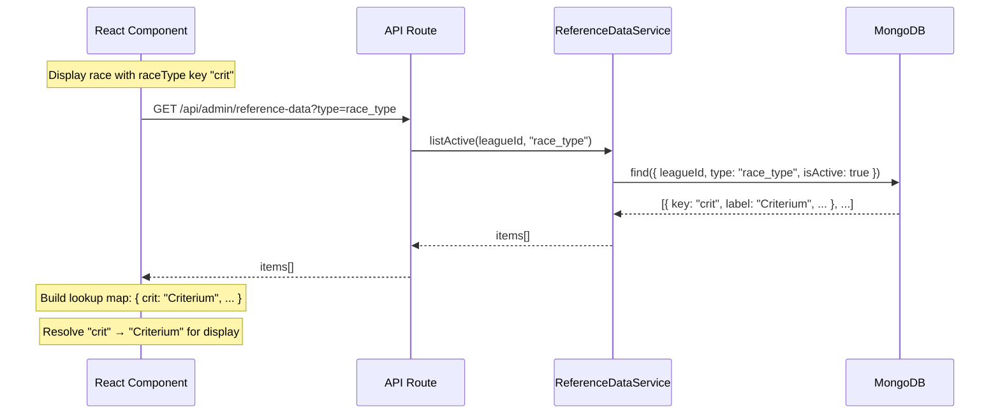
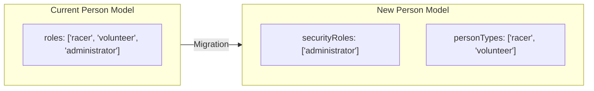

# Design Document: League Reference Data

## Overview

This feature replaces hardcoded TypeScript enums for categories, race types, organization types, and person types with league-scoped reference data stored in MongoDB. Each league independently manages its own set of configurable values through an admin UI, while security-related roles (administrator, super_administrator, league_administrator) remain hardcoded for compile-time safety.

### Key Design Decisions

1. **Single Collection with Type Discriminator**: All reference data is stored in one `reference_data` collection with a `type` field discriminator (category, race_type, organization_type, person_type). This simplifies the service layer (one generic CRUD service), indexing strategy, and migration logic. A compound unique index on `{ leagueId, type, key }` enforces uniqueness.

2. **Keys as Stable Identifiers, Labels as Display**: Entities (Race, Person, Organization, RaceResult) store reference data keys (machine-readable strings). Labels are resolved at display time via lookup. This means label changes propagate instantly without data migration, and historical records remain valid.

3. **Person Model Split: `securityRoles` + `personTypes`**: The existing `roles` array is split into two fields: `securityRoles` (hardcoded enum validated at compile time) and `personTypes` (array of reference data keys validated at runtime against the league's reference data). This cleanly separates permission logic from participant classification.

4. **Soft Delete with Referential Integrity Check for Hard Delete**: Items can be deactivated (soft delete) at any time. Hard delete via the DELETE endpoint is only permitted when no existing records reference the key. This prevents orphaned references while allowing cleanup of unused items.

5. **Default Seeding in LeagueService.create()**: When a new league is created, the LeagueService automatically seeds default reference data items for all four types. This leverages the existing create flow and ensures every league starts with usable data.

6. **Validation Schemas Become Dynamic**: Zod validation schemas for race, person, and organization forms switch from `z.enum([...])` to `z.string().min(1)` with runtime validation against the league's active reference data. The API layer performs the reference data existence check before persisting.

---

## Architecture

### Reference Data Flow

```mermaid
graph TB
    subgraph AdminUI["Admin UI - Reference Data Page"]
        TABS[Tabs: Categories | Race Types | Org Types | Person Types]
        FORM[Create/Edit Form]
        LIST[Sortable Item List]
    end

    subgraph API["API Layer"]
        GET_EP[GET /api/admin/reference-data?type=X]
        POST_EP[POST /api/admin/reference-data]
        PUT_EP[PUT /api/admin/reference-data/:id]
        DEL_EP[DELETE /api/admin/reference-data/:id]
    end

    subgraph Service["Service Layer"]
        RDS[ReferenceDataService]
        VAL[ReferenceDataValidator]
    end

    subgraph Data["MongoDB"]
        RD_COL[(reference_data collection)]
        RACE_COL[(races collection)]
        PERSON_COL[(people collection)]
    end

    TABS --> GET_EP
    FORM --> POST_EP
    FORM --> PUT_EP
    LIST --> DEL_EP
    GET_EP --> RDS
    POST_EP --> RDS
    PUT_EP --> RDS
    DEL_EP --> RDS
    RDS --> RD_COL
    VAL --> RD_COL
    RACE_COL -.->|stores keys| RD_COL
    PERSON_COL -.->|stores keys| RD_COL
```

### Key Resolution Flow



### Person Model Restructuring



---

## Components and Interfaces

### New MongoDB Model

#### `ReferenceDataModel`

```typescript
// src/models/reference-data.model.ts

interface ReferenceDataDocument extends Document {
  key: string;
  label: string;
  description?: string;
  sortOrder: number;
  type: "category" | "race_type" | "organization_type" | "person_type";
  leagueId: mongoose.Types.ObjectId;
  isActive: boolean;
  createdAt: Date;
  updatedAt: Date;
}
```

### New Service

#### `ReferenceDataService`

```typescript
// src/services/reference-data.service.ts

class ReferenceDataService {
  create(data: CreateReferenceDataInput): Promise<ReferenceDataDocument>;
  update(id: string, data: UpdateReferenceDataInput): Promise<ReferenceDataDocument>;
  deactivate(id: string): Promise<ReferenceDataDocument>;
  reactivate(id: string): Promise<ReferenceDataDocument>;
  delete(id: string): Promise<void>;  // fails if referenced
  listActive(leagueId: string, type: ReferenceDataType): Promise<ReferenceDataDocument[]>;
  listAll(leagueId: string, type: ReferenceDataType): Promise<ReferenceDataDocument[]>;
  getByKey(leagueId: string, type: ReferenceDataType, key: string): Promise<ReferenceDataDocument | null>;
  resolveKeys(leagueId: string, type: ReferenceDataType, keys: string[]): Promise<Map<string, string>>;
  validateKeys(leagueId: string, type: ReferenceDataType, keys: string[]): Promise<boolean>;
  seedDefaults(leagueId: string): Promise<void>;
  getNextSortOrder(leagueId: string, type: ReferenceDataType): Promise<number>;
}
```

### New API Routes

| Method | Route | Auth | Description |
|--------|-------|------|-------------|
| GET | `/api/admin/reference-data` | League_Admin+ | List reference data items (query: `type`, scoped to active league) |
| POST | `/api/admin/reference-data` | League_Admin+ | Create a new reference data item |
| PUT | `/api/admin/reference-data/[id]` | League_Admin+ | Update label, description, sortOrder, isActive |
| DELETE | `/api/admin/reference-data/[id]` | League_Admin+ | Hard-delete if unreferenced |

### New Frontend Components

| Component | Location | Description |
|-----------|----------|-------------|
| `ReferenceDataPage` | `src/app/(authenticated)/admin/reference-data/page.tsx` | Admin page with tabs for each type |
| `ReferenceDataTab` | `src/components/admin/reference-data-tab.tsx` | Reusable tab content: list + create/edit form |
| `ReferenceDataForm` | `src/components/admin/reference-data-form.tsx` | Form for creating/editing an item |
| `ReferenceDataList` | `src/components/admin/reference-data-list.tsx` | Sortable list with deactivate/reactivate/delete actions |

### New Hook

```typescript
// src/hooks/use-reference-data.ts

function useReferenceData(type: ReferenceDataType): {
  items: ReferenceDataItem[];
  activeItems: ReferenceDataItem[];
  isLoading: boolean;
  resolveKey: (key: string) => string;  // returns label or raw key as fallback
}
```

### Modified Components

| Component | Change |
|-----------|--------|
| Race form | Category and raceType dropdowns populated from `useReferenceData` |
| Person form | Person type multi-select populated from `useReferenceData("person_type")` |
| Organization form | Organization type dropdown from `useReferenceData("organization_type")` |
| Result form | Category dropdown from `useReferenceData("category")` |

### Modified Validation Schemas

| Schema | Change |
|--------|--------|
| `createRaceSchema` | `raceType: z.string().min(1)` instead of `z.enum(...)` |
| `createRaceSchema` | `categories: z.array(z.string().min(1))` instead of `z.array(z.enum(...))` |
| `createPersonSchema` | Remove person types from `roles` enum; add `personTypes: z.array(z.string())` |
| `updatePersonSchema` | Same split as create |

### Modified Person Model

```typescript
// Updated PersonSchema fields
{
  securityRoles: {
    type: [String],
    enum: ["administrator", "super_administrator", "league_administrator"],
    default: [],
  },
  personTypes: {
    type: [String],  // reference data keys, validated at runtime
    default: [],
  },
  // roles field deprecated/removed after migration
}
```

---

## Data Models

### New Collection: `reference_data`

```typescript
interface ReferenceData {
  _id: ObjectId;
  key: string;              // machine-readable identifier (e.g., "cat1", "crit")
  label: string;            // human-readable display name (e.g., "Category 1", "Criterium")
  description?: string;     // optional longer description
  sortOrder: number;        // display ordering within type+league
  type: "category" | "race_type" | "organization_type" | "person_type";
  leagueId: ObjectId;       // scoped to one league
  isActive: boolean;        // soft-delete flag
  createdAt: Date;
  updatedAt: Date;
}

// Indexes:
// Unique compound: { leagueId: 1, type: 1, key: 1 }
// Query index: { leagueId: 1, type: 1, isActive: 1, sortOrder: 1 }
```

### Modified Collection: `people`

```typescript
interface Person {
  _id: ObjectId;
  name: { first: string; last: string };
  email: string;
  phone?: string;
  securityRoles: ("administrator" | "super_administrator" | "league_administrator")[];
  personTypes: string[];     // reference data keys (e.g., ["racer", "volunteer"])
  adminScope?: { type: "super" | "league"; leagueIds?: ObjectId[] };
  category?: string;         // reference data key (unchanged field name, now validated at runtime)
  categoryHistory: CategoryChange[];
  usaCyclingLicense?: string;
  organizationIds: ObjectId[];
  passwordHash?: string;
  authProvider?: "local" | "google" | "apple";
  authProviderId?: string;
  isRegistered: boolean;
  createdAt: Date;
  updatedAt: Date;
}
```

### Default Reference Data Values

These are seeded for new leagues and created during migration:

| Type | Key | Label | Sort Order |
|------|-----|-------|-----------|
| category | cat1 | Category 1 | 1 |
| category | cat2 | Category 2 | 2 |
| category | cat3 | Category 3 | 3 |
| category | cat4 | Category 4 | 4 |
| category | cat5 | Category 5 | 5 |
| category | beginner | Beginner | 6 |
| race_type | crit | Criterium | 1 |
| race_type | time_trial | Time Trial | 2 |
| race_type | road_race | Road Race | 3 |
| race_type | cyclocross | Cyclocross | 4 |
| race_type | gravel | Gravel | 5 |
| race_type | track | Track | 6 |
| organization_type | team | Team | 1 |
| organization_type | promoter | Promoter | 2 |
| organization_type | sponsor | Sponsor | 3 |
| organization_type | other | Other | 4 |
| person_type | racer | Racer | 1 |
| person_type | volunteer | Volunteer | 2 |
| person_type | mentor | Mentor | 3 |
| person_type | race_official | Race Official | 4 |

### Referential Integrity Check Targets

When a DELETE is requested, the service checks these collections for references:

| Reference Data Type | Collections to Check | Field |
|--------------------|--------------------|-------|
| category | races (categories array), race_results (category), people (category) | category / categories |
| race_type | races | raceType |
| organization_type | organizations | type |
| person_type | people | personTypes |

---

## Correctness Properties

*A property is a characteristic or behavior that should hold true across all valid executions of a system—essentially, a formal statement about what the system should do. Properties serve as the bridge between human-readable specifications and machine-verifiable correctness guarantees.*

### Property 1: Reference data persistence round-trip

*For any* valid reference data item (with key, label, type, leagueId, sortOrder, and optional description), creating it via the service and reading it back SHALL produce an item with all original field values preserved.

**Validates: Requirements 1.1, 1.2, 1.5, 3.1, 4.1, 5.1, 6.1**

### Property 2: Key uniqueness within league and type

*For any* league, reference data type, and key string, creating a second item with the same (leagueId, type, key) combination SHALL be rejected with a duplicate key error, while creating the same key in a different league or different type SHALL succeed.

**Validates: Requirements 1.3, 3.4, 4.4, 5.4, 6.4**

### Property 3: Auto-increment sort order

*For any* league and reference data type with N existing items, creating a new item without an explicit sortOrder SHALL assign sortOrder = N + 1, and creating K items in sequence SHALL assign sortOrders 1 through K when no prior items exist.

**Validates: Requirements 1.6**

### Property 4: Key immutability on update

*For any* reference data item, updating its label, description, or sortOrder SHALL persist those changes while the key field remains equal to its original value.

**Validates: Requirements 3.2, 4.2, 5.2, 6.2**

### Property 5: Deactivation preserves referencing records

*For any* reference data item that is referenced by existing records (races, people, results, organizations), deactivating the item SHALL set isActive to false without modifying any of the referencing records.

**Validates: Requirements 3.3, 4.3, 5.3, 6.3**

### Property 6: Active-only filtering scoped by league and type, sorted by sortOrder

*For any* league with a mix of active and inactive reference data items across multiple types, querying active items for a specific (leagueId, type) pair SHALL return only items where isActive=true AND leagueId matches AND type matches, ordered ascending by sortOrder.

**Validates: Requirements 3.5, 3.6, 4.5, 4.6, 5.5, 5.6, 6.5, 6.6, 7.3, 8.1**

### Property 7: Delete blocked when item is referenced

*For any* reference data item whose key is stored in at least one existing record (race, person, organization, or result), attempting to delete that item SHALL be rejected with a referential integrity error. For any item whose key is not referenced by any record, deletion SHALL succeed and the item SHALL no longer exist.

**Validates: Requirements 8.4, 8.5**

### Property 8: Key-to-label resolution with fallback

*For any* set of reference data keys, resolving them against a league's reference data SHALL return the current label for keys that exist (active or inactive) and SHALL return the raw key string for keys that do not match any item.

**Validates: Requirements 9.2, 9.3, 9.4, 11.6**

### Property 9: Form validation rejects invalid or inactive keys

*For any* reference data key submitted in a form, the system SHALL accept the key only if it corresponds to an active Reference_Data_Item for the given league and type. Keys that are inactive or do not exist SHALL be rejected.

**Validates: Requirements 9.5, 2.5**

### Property 10: Security roles and person types are independent

*For any* person with any combination of security roles and person type assignments, the permission evaluation SHALL use only the securityRoles field, and modifying personTypes SHALL not affect permission outcomes. Conversely, modifying securityRoles SHALL not affect the personTypes field.

**Validates: Requirements 2.3, 11.3, 11.4, 11.5**

### Property 11: Migration idempotency

*For any* league that already has reference data items of a given type, running the migration a second time SHALL not create duplicate items, and the total count of items for that league+type SHALL remain unchanged.

**Validates: Requirements 10.7**

### Property 12: Migration splits person roles correctly

*For any* person whose existing roles array contains a mix of security roles (administrator, super_administrator, league_administrator) and person types (racer, volunteer, mentor, race_official), after migration the securityRoles field SHALL contain exactly the security role values and the personTypes field SHALL contain exactly the person type values, with no values lost or duplicated.

**Validates: Requirements 11.7, 2.1, 2.2**

### Property 13: Default seeding on league creation

*For any* newly created league, the system SHALL automatically create reference data items for all four types with the expected default keys, and querying each type SHALL return the complete default set.

**Validates: Requirements 12.1, 12.2, 12.3, 12.4**

### Property 14: Write operations require admin authorization

*For any* user without a League_Administrator or Super_Administrator security role, all write operations (POST, PUT, DELETE) on the reference data API SHALL be rejected with a 403 status.

**Validates: Requirements 8.6, 7.1**

---

## Error Handling

### New Error Codes

| Code | HTTP Status | Description |
|------|-------------|-------------|
| `REFERENCE_DATA_DUPLICATE_KEY` | 409 | Key already exists for this league+type |
| `REFERENCE_DATA_NOT_FOUND` | 404 | Reference data item does not exist |
| `REFERENCE_DATA_IN_USE` | 409 | Cannot delete; item is referenced by existing records |
| `INVALID_REFERENCE_DATA_KEY` | 422 | Submitted key does not match an active reference data item |
| `INVALID_REFERENCE_DATA_TYPE` | 400 | Type must be one of: category, race_type, organization_type, person_type |

### Error Handling Patterns

| Operation | Error Condition | Response |
|-----------|----------------|----------|
| POST create | Duplicate key in league+type | 409 `REFERENCE_DATA_DUPLICATE_KEY` with existing key info |
| POST create | Invalid type value | 400 `INVALID_REFERENCE_DATA_TYPE` |
| PUT update | Item not found | 404 `REFERENCE_DATA_NOT_FOUND` |
| PUT update | Attempt to change key | 400 `VALIDATION_ERROR` (key field not in update schema) |
| DELETE | Item referenced by records | 409 `REFERENCE_DATA_IN_USE` with count of references |
| DELETE | Item not found | 404 `REFERENCE_DATA_NOT_FOUND` |
| Race/Person create | Invalid category/raceType/personType key | 422 `INVALID_REFERENCE_DATA_KEY` with the invalid key value |
| Any write | Non-admin user | 403 `FORBIDDEN` |
| Any operation | Missing leagueId | 400 `LEAGUE_REQUIRED` |

### Migration Error Handling

- Migration logs progress for each league and type
- On duplicate key error (idempotency): skip and continue
- On unexpected error: log full context, halt migration, report which leagues were completed
- Migration is re-runnable; completed leagues are skipped via the existence check

---

## Testing Strategy

### Dual Testing Approach

This feature uses both property-based tests and example-based unit tests for comprehensive coverage.

#### Property-Based Testing

**Library**: `fast-check` (already in devDependencies)

**Configuration**:
- Minimum 100 iterations per property test
- Each property test references its design document property via tag comment
- Tag format: `// Feature: league-reference-data, Property {number}: {property_text}`
- Tests located in `tests/property/reference-data/`

**Properties to implement**:
- Property 1: Persistence round-trip
- Property 2: Key uniqueness within league+type
- Property 3: Auto-increment sort order
- Property 4: Key immutability on update
- Property 5: Deactivation preserves referencing records
- Property 6: Active-only filtering scoped by league and type
- Property 7: Delete blocked when referenced
- Property 8: Key-to-label resolution with fallback
- Property 9: Form validation rejects invalid/inactive keys
- Property 10: Security roles and person types are independent
- Property 11: Migration idempotency
- Property 12: Migration splits roles correctly
- Property 13: Default seeding on league creation
- Property 14: Write operations require admin authorization

**Generator Strategy**:
- `arbitraryKey`: lowercase alphanumeric + underscore, 1-30 chars
- `arbitraryLabel`: printable string, 1-100 chars
- `arbitraryType`: one of the four valid types
- `arbitraryLeagueId`: valid ObjectId string
- `arbitraryReferenceDataItem`: full valid item combining the above

#### Unit / Example-Based Testing

**Framework**: Jest (existing setup, `tests/unit/` directory)

Focus areas:
- ReferenceDataService CRUD methods (happy paths)
- Default label mapping correctness (specific keys → specific labels)
- API route handler responses for each HTTP method
- Validation schema acceptance/rejection with concrete inputs
- Referential integrity check logic for each collection
- Sort order edge cases (first item, gap filling)

#### Integration Testing

- Full admin workflow: create league → verify defaults seeded → add custom items → use in race form
- Migration script against test database with multiple leagues
- Person model migration: roles array split into securityRoles + personTypes
- Reference data in forms: create race with dynamic category validation

#### End-to-End Testing

**Framework**: Playwright

- Reference data admin page: navigate tabs, create item, edit label, deactivate, reactivate
- Race creation form: verify category dropdown populated from reference data
- Person form: verify person type multi-select from reference data
- Deactivated item not shown in form dropdowns but shown in admin list
