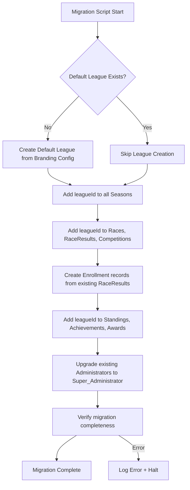
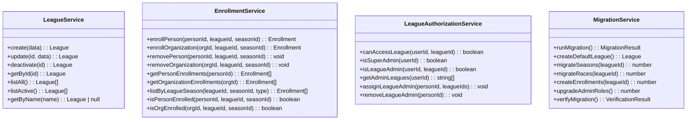

# Design Document: Multi-League Support

## Overview

This feature extends the Bike Racing League platform from a single-league application into a multi-tenant system where multiple independent leagues coexist within the same application instance. A new top-level **League** entity serves as the container for all competitive activity. Seasons, Enrollments, Races, Race Results, Standings, Achievements, Awards, and Calculated Recognitions are scoped to a League-Season combination. A tiered administrative role system separates platform-wide Super_Administrators from league-specific League_Administrators.

### Key Design Decisions

1. **League as a First-Class Entity with `leagueId` Foreign Key Pattern**: Rather than embedding league data in existing documents, we add a `leagueId` reference field to existing collections (Season, Race, Competition, etc.). This keeps the data model flat and allows efficient per-league queries via compound indexes.

2. **Enrollment Collection for Many-to-Many**: A dedicated `enrollments` collection manages the relationship between Persons/Organizations and League-Season combinations. This avoids bloating the Person/Organization documents with league arrays and supports efficient enrollment queries.

3. **League-Scoped Branding via Embedded Document**: Each League document contains its own `BrandingConfiguration` embedded subdocument (moved from the standalone `branding` collection), enabling atomic league+branding reads and eliminating a separate lookup.

4. **Zustand Store for Active League Context**: The frontend maintains the active league selection in a Zustand store, persisted to `localStorage`. All API calls from authenticated views include the active `leagueId` as a query parameter or header, ensuring server-side filtering matches the client context.

5. **Additive Schema Migration**: Existing data is migrated into a "default league" created from the current branding configuration. New `leagueId` fields are added to existing documents. The migration is idempotent and can be re-run safely.

6. **Role Hierarchy via JWT Claims**: The JWT payload is extended with `adminScope` (containing `type: 'super' | 'league'` and `leagueIds: string[]`). Middleware validates access based on these claims without additional database lookups per request.

---

## Architecture

### Updated System Architecture

```mermaid
graph TB
    subgraph Client["Client (Browser)"]
        UI[React UI - Next.js Pages]
        TQ[TanStack Query]
        ZS[Zustand Store - League Context]
        LS[localStorage - persisted league]
    end

    subgraph Heroku["Heroku Platform"]
        subgraph NextApp["Next.js Application"]
            SSR[SSR / Static Pages]
            API[API Routes /api/*]
            MW[Middleware - Auth + League Scope]
            LMW[League Authorization Middleware]
        end
        
        subgraph Data["Data Layer"]
            MDB[(MongoDB)]
            TSDB[(TimescaleDB)]
            REDIS[(Redis - Cache)]
        end
    end

    UI --> TQ
    TQ --> API
    ZS --> UI
    ZS --> LS
    SSR --> MDB
    API --> MW
    MW --> LMW
    LMW --> MDB
    LMW --> TSDB
    REDIS --> MW

    style Client fill:#1a1a2e,stroke:#b87333
    style Heroku fill:#16213e,stroke:#b87333
```



### League Context Flow

```mermaid
sequenceDiagram
    participant B as Browser
    participant ZS as Zustand Store
    participant API as API Routes
    participant MW as Auth + League Middleware
    participant DB as MongoDB

    Note over B,ZS: User switches league via selector
    B->>ZS: setActiveLeague(leagueId)
    ZS->>ZS: Persist to localStorage
    ZS->>B: Re-render with new league context

    Note over B,DB: Subsequent API calls include leagueId
    B->>API: GET /api/admin/races?leagueId=abc
    API->>MW: Validate JWT + check league access
    MW->>MW: Super_Admin → allow all; League_Admin → check leagueIds claim
    MW->>DB: Query with leagueId filter
    DB-->>API: Filtered results
    API-->>B: League-scoped data
```

### Migration Flow



---

## Components and Interfaces

### New Frontend Components

| Component | Description |
|-----------|-------------|
| `LeagueSelector` | Dropdown in the authenticated TopBar; shows available leagues based on user role/enrollments; dispatches `setActiveLeague` to Zustand store |
| `PublicLeagueSelector` | Dropdown on the public Standings page allowing visitors to choose which league's standings to view |
| `LeagueAdminPage` | Admin page for Super_Administrators to create/edit/deactivate leagues |
| `EnrollmentManagementPanel` | Admin component for managing person and organization enrollments within the active league-season |
| `LeagueBrandingForm` | Extended branding form scoped to active league context |

### Modified Frontend Components

| Component | Change |
|-----------|--------|
| `TopBar` | League selector becomes functional (currently static text) |
| `Sidebar` | Reflects branding of active league |
| `ThemeProvider` | Sources branding from active league's configuration |
| `StandingsPage` | Adds league selector; filters standings by league + season |
| `TrophyCasePage` | Groups achievements/awards by league then season |
| `AdminSeasonsPage` | Shows only seasons for active league; requires league selection |
| `AdminRacesPage` | Filters races by active league context |
| `AdminPeoplePage` | Shows enrollment status for active league-season |

### New Zustand Store: `useLeagueStore`

```typescript
interface LeagueState {
  activeLeagueId: string | null;
  activeLeagueName: string | null;
  availableLeagues: { id: string; name: string }[];
  setActiveLeague: (leagueId: string) => void;
  setAvailableLeagues: (leagues: { id: string; name: string }[]) => void;
  clearLeagueContext: () => void;
}
```

### New API Routes

| Method | Route | Auth | Description |
|--------|-------|------|-------------|
| GET | `/api/admin/leagues` | Super_Admin | List all leagues |
| POST | `/api/admin/leagues` | Super_Admin | Create a new league |
| PUT | `/api/admin/leagues/[leagueId]` | Super_Admin | Update league name/description |
| PATCH | `/api/admin/leagues/[leagueId]/deactivate` | Super_Admin | Deactivate a league |
| GET | `/api/leagues` | Public | List active leagues (for public selector) |
| GET | `/api/leagues/[leagueId]/branding` | Public | Get branding for a specific league |
| PUT | `/api/admin/leagues/[leagueId]/branding` | League_Admin+ | Update league branding |
| GET | `/api/admin/enrollments` | League_Admin+ | List enrollments for active league-season |
| POST | `/api/admin/enrollments/persons` | League_Admin+ | Enroll a person in a league-season |
| DELETE | `/api/admin/enrollments/persons/[personId]` | League_Admin+ | Remove person enrollment |
| POST | `/api/admin/enrollments/organizations` | League_Admin+ | Enroll an organization |
| DELETE | `/api/admin/enrollments/organizations/[orgId]` | League_Admin+ | Remove organization enrollment |
| GET | `/api/user/leagues` | Authenticated | Get leagues available to the current user |
| POST | `/api/admin/people/[personId]/league-admin` | Super_Admin | Assign League_Admin role with league assignments |
| DELETE | `/api/admin/people/[personId]/league-admin` | Super_Admin | Remove League_Admin role |

### Modified API Routes

All existing admin routes gain `leagueId` scoping:

| Route | Change |
|-------|--------|
| `/api/admin/seasons` | Requires `leagueId` query param; CRUD scoped to league |
| `/api/admin/races` | Requires `leagueId`; associates races with league |
| `/api/admin/races/[raceId]/results` | Validates racer enrollment in league-season |
| `/api/admin/competitions` | Requires `leagueId`; scopes to league-season |
| `/api/admin/achievements` | Scoped to league-season for earned achievements |
| `/api/admin/awards` | Award assignment scoped to active league-season |
| `/api/admin/branding` | Redirects to league-specific branding route |
| `/api/standings` | Accepts `leagueId` query param for public filtering |
| `/api/people/[personId]/trophy-case` | Groups by league then season |

### Service Layer Changes



### Modified Services

| Service | Changes |
|---------|---------|
| `SeasonService` | All methods accept `leagueId`; overlap check scoped to league; active season per league |
| `RaceService` | `create()` and `list()` require `leagueId`; associates league with race |
| `RaceResultService` | `enter()` validates racer enrollment; associates `leagueId` |
| `StandingsService` | `calculate()` scoped to league-season; filters by enrolled racers/teams |
| `AchievementService` | `checkAndAward()` tracks progress per league-season |
| `AwardService` | `assign()` scopes to active league-season |
| `CompetitionService` | `create()` requires league-season context |
| `BrandingService` | Reads/writes branding from League document instead of standalone collection |
| `CalculatedRecognitionService` | `compute()` scoped to league-season |

### Middleware Stack Update

```typescript
// Existing middleware order (updated)
// 1. Morgan - HTTP request logging
// 2. Helmet - Security headers
// 3. JWT Verification - Token validation
// 4. League Context Extraction - Reads leagueId from query/header
// 5. League Authorization - Validates user can access the league
// 6. Rate Limiting
// 7. Branding Loader - Loads branding for active league
```

The new **League Authorization Middleware** (`leagueAuthMiddleware`):

```typescript
interface LeagueAuthContext {
  leagueId: string;
  isSuperAdmin: boolean;
  isLeagueAdmin: boolean;
  adminLeagueIds: string[];
}

// Applied to all /api/admin/* routes
// - Extracts leagueId from request (query param or X-League-Id header)
// - For Super_Admin: allows access to any league
// - For League_Admin: allows only if leagueId is in their assigned leagues
// - For other authenticated users: denies admin operations
```

---

## Data Models

### New MongoDB Collections

#### `leagues`

```typescript
interface League {
  _id: ObjectId;
  name: string;           // unique
  description?: string;
  isActive: boolean;
  branding: {
    leagueName: string;
    logos: {
      square: string;
      horizontal: string;
      vertical: string;
    };
    mainColors: [string, string, string];
    accentColors: string[];   // 1 or 2 colors
  };
  createdAt: Date;
  updatedAt: Date;
}
```

#### `enrollments`

```typescript
interface Enrollment {
  _id: ObjectId;
  entityType: 'person' | 'organization';
  entityId: ObjectId;       // references Person or Organization
  leagueId: ObjectId;
  seasonId: ObjectId;
  enrolledAt: Date;
  enrolledBy: ObjectId;     // admin who performed enrollment
  isActive: boolean;
  createdAt: Date;
  updatedAt: Date;
}

// Unique compound index: { entityType, entityId, leagueId, seasonId }
// Index: { leagueId, seasonId, entityType }
// Index: { entityId, entityType }
```

### Modified MongoDB Collections

#### `people` (modified)

```typescript
interface Person {
  // ... existing fields ...
  roles: Role[]; // Extended: 'super_administrator' | 'league_administrator' | 'racer' | 'volunteer' | 'mentor' | 'race_official'
  adminScope?: {
    type: 'super' | 'league';
    leagueIds?: ObjectId[];  // Only for league_administrator
  };
}
```

#### `seasons` (modified)

```typescript
interface Season {
  // ... existing fields ...
  leagueId: ObjectId;  // NEW: required reference to parent League
}
// New index: { leagueId: 1, isActive: 1 }
// Updated overlap check: scoped to same leagueId
```

#### `races` (modified)

```typescript
interface Race {
  // ... existing fields ...
  leagueId: ObjectId;  // NEW: denormalized from season for query efficiency
}
// New index: { leagueId: 1, date: 1 }
```

#### `race_results` (modified)

```typescript
interface RaceResult {
  // ... existing fields ...
  leagueId: ObjectId;  // NEW: denormalized for query efficiency
}
// New index: { leagueId: 1, seasonId: 1, racerId: 1 }
```

#### `competitions` (modified)

```typescript
interface Competition {
  // ... existing fields ...
  leagueId: ObjectId;  // NEW: reference to parent League
}
// New index: { leagueId: 1, seasonId: 1 }
```

#### `standings` (modified)

```typescript
interface Standing {
  // ... existing fields ...
  leagueId: ObjectId;  // NEW
}
// New index: { leagueId: 1, competitionId: 1, seasonId: 1, position: 1 }

interface TeamStanding {
  // ... existing fields ...
  leagueId: ObjectId;  // NEW
}
// New index: { leagueId: 1, competitionId: 1, seasonId: 1, position: 1 }
```

#### `earned_achievements` (modified)

```typescript
interface EarnedAchievement {
  // ... existing fields ...
  leagueId: ObjectId;  // NEW
}
// Updated unique index: { achievementId, personId, seasonId, leagueId }
```

#### `assigned_awards` (modified)

```typescript
interface AssignedAward {
  // ... existing fields ...
  leagueId: ObjectId;  // NEW
}
// New index: { leagueId: 1, seasonId: 1 }
```

#### `earned_recognitions` (modified)

```typescript
interface EarnedRecognition {
  // ... existing fields ...
  leagueId: ObjectId;  // NEW
}
```

#### `branding` collection (deprecated)

The standalone `branding` collection is deprecated. Branding configuration moves into the `League` document as an embedded subdocument. The migration copies the existing branding config into the default league document.

### TimescaleDB Changes

All time-series tables gain a `league_id` column:

```sql
-- Add league_id to standings_history
ALTER TABLE standings_history ADD COLUMN league_id TEXT NOT NULL DEFAULT 'default';
CREATE INDEX idx_standings_league ON standings_history (league_id, person_id, competition_id, time DESC);

-- Add league_id to team_standings_history
ALTER TABLE team_standings_history ADD COLUMN league_id TEXT NOT NULL DEFAULT 'default';
CREATE INDEX idx_team_standings_league ON team_standings_history (league_id, organization_id, competition_id, time DESC);

-- Add league_id to race_performance
ALTER TABLE race_performance ADD COLUMN league_id TEXT NOT NULL DEFAULT 'default';
CREATE INDEX idx_perf_league ON race_performance (league_id, person_id, time DESC);
```

### JWT Payload Extension

```typescript
interface JwtPayload {
  userId: string;
  email: string;
  roles: Role[];
  adminScope?: {
    type: 'super' | 'league';
    leagueIds?: string[];  // ObjectId strings for league_administrator
  };
}
```

---


## Correctness Properties

*A property is a characteristic or behavior that should hold true across all valid executions of a system—essentially, a formal statement about what the system should do. Properties serve as the bridge between human-readable specifications and machine-verifiable correctness guarantees.*

### Property 1: League name uniqueness

*For any* two league creation attempts with the same name (case-insensitive), the second creation SHALL be rejected, and the system SHALL contain exactly one league with that name.

**Validates: Requirements 1.3, 1.6**

### Property 2: League modification preserves associated data

*For any* league with N associated seasons and M enrollments, updating the league's name or description, or deactivating the league, SHALL result in the same N seasons and M enrollments remaining associated with that league.

**Validates: Requirements 1.2, 1.5**

### Property 3: Single active season per league invariant

*For any* league with multiple seasons, at most one season within that league SHALL be marked active at any given point in time, regardless of the sequence of activation operations performed.

**Validates: Requirements 2.4**

### Property 4: Season overlap rejection scoped to league

*For any* league and any two date ranges [S1, E1] and [S2, E2] where the ranges overlap (S1 <= E2 AND S2 <= E1), creating both seasons within the same league SHALL result in the second being rejected. For non-overlapping ranges in the same league, both SHALL succeed.

**Validates: Requirements 2.5**

### Property 5: Cross-league season overlap allowed

*For any* two distinct leagues and any date range [S, E], creating a season with that date range in each league SHALL both succeed, regardless of overlap.

**Validates: Requirements 2.6**

### Property 6: Enrollment uniqueness

*For any* entity (person or organization) and any league-season combination, attempting to create a second enrollment for the same entity in the same league-season SHALL be rejected, and exactly one enrollment record SHALL exist.

**Validates: Requirements 3.5, 4.5**

### Property 7: Enrollment removal preserves historical data

*For any* enrolled person with N race results and M earned achievements in a league-season, removing their enrollment SHALL leave all N race results and M achievements intact in the database.

**Validates: Requirements 3.4, 4.4**

### Property 8: Non-enrolled entities excluded from standings

*For any* league-season and any person (or team-type organization) NOT enrolled in that league-season, that entity SHALL NOT appear in the standings or team standings for that league-season, even if race results exist for them.

**Validates: Requirements 3.6, 4.6, 7.5, 7.6**

### Property 9: Enrollment filtering returns only enrolled entities

*For any* league-season with a set of enrolled entities E and a set of non-enrolled entities N, querying enrollments for that league-season SHALL return exactly the set E and no members of N.

**Validates: Requirements 3.7, 4.7**

### Property 10: League-season isolation of competitive data

*For any* person enrolled in two distinct leagues A and B, race results entered in league A SHALL only contribute to standings, achievement progress, and calculated recognitions in league A, and SHALL NOT affect any computed data in league B.

**Validates: Requirements 5.2, 5.3, 5.6, 5.7**

### Property 11: Race result entry validates enrollment

*For any* racer NOT enrolled in the league-season associated with a race, entering a race result for that racer in that race SHALL be rejected with an enrollment validation error.

**Validates: Requirements 9.6**

### Property 12: API data scoping to active league context

*For any* API endpoint that accepts a leagueId parameter and returns a collection of records, all returned records SHALL have a leagueId matching the requested leagueId.

**Validates: Requirements 6.7, 9.4**

### Property 13: League selector shows enrolled leagues for non-admin users

*For any* non-administrator user enrolled in a set of N leagues, the league selector API SHALL return exactly those N leagues (no more, no fewer).

**Validates: Requirements 6.2**

### Property 14: Trophy case groups by league then season

*For any* person with achievements/awards across L leagues and S total seasons, the trophy case response SHALL contain exactly L league groups, and within each league group, the achievements and awards SHALL be partitioned by the seasons in which they were earned within that league.

**Validates: Requirements 8.1, 8.3, 8.4**

### Property 15: Standings recalculation isolation

*For any* race result update in league A, the standings in any other league B SHALL remain unchanged (identical positions, points, and lastUpdated timestamps).

**Validates: Requirements 7.7**

### Property 16: League branding switches with context

*For any* two leagues with distinct branding configurations, switching the active league context from league A to league B SHALL cause the branding API to return league B's branding (different colors, logos, and league name).

**Validates: Requirements 11.3**

### Property 17: Super administrator unrestricted access

*For any* admin API endpoint and any user with the super_administrator role, the authorization check SHALL grant access regardless of which leagueId is specified.

**Validates: Requirements 12.1**

### Property 18: League administrator access scoped to assigned leagues

*For any* user with the league_administrator role assigned to a set of leagues L, the authorization check SHALL grant access for any leagueId in L and SHALL deny access for any leagueId not in L.

**Validates: Requirements 12.2, 12.5, 12.6**

### Property 19: League CRUD restricted to super administrators

*For any* user without the super_administrator role (including league_administrators), attempting to create, update, or delete a League SHALL be denied with a 403 Forbidden response.

**Validates: Requirements 12.7, 12.8**

### Property 20: League admin selector shows only assigned leagues

*For any* league_administrator assigned to a subset S of all leagues, the league selector API SHALL return exactly the leagues in S.

**Validates: Requirements 12.9**

### Property 21: Migration creates enrollments from existing data

*For any* person with race results in season X (pre-migration), after migration that person SHALL have an enrollment record in the default league for season X.

**Validates: Requirements 10.3, 10.4**

### Property 22: Migration preserves data without loss

*For any* set of pre-migration records (seasons, races, race results, standings, achievements, awards), the count of records after migration SHALL equal the count before migration, and all original field values SHALL be preserved (with only `leagueId` added).

**Validates: Requirements 10.6**

### Property 23: Cross-league race results without conflict

*For any* person enrolled in two leagues, entering race results for the same person in races from different leagues SHALL both succeed without violating any uniqueness constraints.

**Validates: Requirements 9.5**

---

## Error Handling

### New Error Codes

| Code | HTTP Status | Description |
|------|-------------|-------------|
| `LEAGUE_NOT_FOUND` | 404 | Referenced league does not exist |
| `LEAGUE_DUPLICATE_NAME` | 409 | League with the given name already exists |
| `LEAGUE_INACTIVE` | 422 | Operation attempted on an inactive league |
| `ENROLLMENT_DUPLICATE` | 409 | Entity is already enrolled in the league-season |
| `ENROLLMENT_NOT_FOUND` | 404 | Enrollment record does not exist |
| `NOT_ENROLLED` | 422 | Racer is not enrolled in the league-season (race result entry) |
| `LEAGUE_REQUIRED` | 400 | leagueId parameter is missing from request |
| `LEAGUE_ACCESS_DENIED` | 403 | League_Administrator attempted operation on unassigned league |
| `SUPER_ADMIN_REQUIRED` | 403 | Operation requires Super_Administrator role |
| `SEASON_OVERLAP_IN_LEAGUE` | 409 | Season date range overlaps with existing season in the same league |
| `ACTIVE_SEASON_EXISTS` | 409 | Cannot activate season; another season in this league is already active |
| `MIGRATION_ERROR` | 500 | Migration encountered an error and was halted |

### Error Handling Patterns

| Operation | Error Condition | Handling |
|-----------|----------------|----------|
| League creation | Duplicate name | 409 with `LEAGUE_DUPLICATE_NAME` and existing league ID |
| Season creation | Overlap in same league | 409 with `SEASON_OVERLAP_IN_LEAGUE` and conflicting season details |
| Season activation | Active season exists in league | 409 with `ACTIVE_SEASON_EXISTS` |
| Race result entry | Racer not enrolled | 422 with `NOT_ENROLLED` and enrollment instructions |
| Admin operation | No leagueId provided | 400 with `LEAGUE_REQUIRED` |
| Admin operation | League admin on wrong league | 403 with `LEAGUE_ACCESS_DENIED` |
| League CRUD | Non-super-admin | 403 with `SUPER_ADMIN_REQUIRED` |
| Enrollment | Duplicate | 409 with `ENROLLMENT_DUPLICATE` |
| Migration | Any error | 500, log full error, halt migration, preserve pre-migration state |

### Migration Error Recovery

The migration script uses a transaction-like approach:
1. Records the migration start timestamp
2. Performs all operations
3. On error: logs the error with full context, records the failure point, and exits without committing partial changes (uses MongoDB sessions where possible)
4. Migration is idempotent: re-running skips already-migrated records (checks for existing `leagueId` field)

---

## Testing Strategy

### Dual Testing Approach

This feature uses both unit/example-based tests and property-based tests for comprehensive coverage.

#### Property-Based Testing

**Library**: [fast-check](https://github.com/dubzzz/fast-check) (TypeScript PBT library)

**Configuration**:
- Minimum 100 iterations per property test
- Each property test references its design document property via tag comment
- Tag format: `// Feature: multi-league-support, Property {number}: {property_text}`

**Properties to implement** (from Correctness Properties section):
- Property 1: League name uniqueness
- Property 2: League modification preserves associated data
- Property 3: Single active season per league invariant
- Property 4: Season overlap rejection scoped to league
- Property 5: Cross-league season overlap allowed
- Property 6: Enrollment uniqueness
- Property 7: Enrollment removal preserves historical data
- Property 8: Non-enrolled entities excluded from standings
- Property 9: Enrollment filtering returns only enrolled entities
- Property 10: League-season isolation of competitive data
- Property 11: Race result entry validates enrollment
- Property 12: API data scoping to active league context
- Property 13: League selector shows enrolled leagues
- Property 14: Trophy case groups by league then season
- Property 15: Standings recalculation isolation
- Property 16: League branding switches with context
- Property 17: Super administrator unrestricted access
- Property 18: League administrator access scoped to assigned leagues
- Property 19: League CRUD restricted to super administrators
- Property 20: League admin selector shows only assigned leagues
- Property 21: Migration creates enrollments from existing data
- Property 22: Migration preserves data without loss
- Property 23: Cross-league race results without conflict

#### Unit / Example-Based Testing

**Framework**: Jest (existing project setup)

Focus areas:
- League CRUD operations (create, read, update, deactivate)
- Enrollment creation and removal
- Season creation with league association
- League context switching behavior (Zustand store)
- JWT payload with adminScope
- Branding embedded in league document
- Default branding initialization on league creation
- Migration script happy path (end-to-end with test database)
- Migration error halt behavior

#### Integration Testing

- Full admin workflow with league scoping (create league → create season → enroll racer → enter results → verify standings)
- League context switching propagation (switch league → verify all subsequent API calls return correct data)
- Authorization flow (league admin attempts access to unassigned league → 403)
- Migration script against realistic test data

#### End-to-End Testing

**Framework**: Playwright (existing project setup)

- League selector dropdown interaction and context switching
- Public standings page league selector for visitors
- Admin workflow within league context
- Trophy case display with multiple leagues
- Branding changes on league switch (verify CSS custom properties update)

### Test Organization

```
tests/
├── unit/
│   ├── services/
│   │   ├── league.service.test.ts
│   │   ├── enrollment.service.test.ts
│   │   └── league-authorization.service.test.ts
│   ├── middleware/
│   │   └── league-auth.middleware.test.ts
│   └── stores/
│       └── league.store.test.ts
├── property/
│   ├── league-management.prop.ts       # Properties 1, 2
│   ├── league-seasons.prop.ts          # Properties 3, 4, 5
│   ├── enrollment.prop.ts              # Properties 6, 7, 8, 9
│   ├── league-scoping.prop.ts          # Properties 10, 11, 12, 15, 23
│   ├── league-selector.prop.ts         # Properties 13, 20
│   ├── trophy-case-league.prop.ts      # Property 14
│   ├── league-branding.prop.ts         # Property 16
│   ├── league-authorization.prop.ts    # Properties 17, 18, 19
│   └── league-migration.prop.ts        # Properties 21, 22
├── integration/
│   ├── api/
│   │   ├── league-admin-workflow.test.ts
│   │   ├── enrollment-flow.test.ts
│   │   └── league-auth.test.ts
│   └── migration/
│       └── migration-script.test.ts
└── e2e/
    ├── league-switching.spec.ts
    ├── multi-league-standings.spec.ts
    └── league-admin.spec.ts
```
